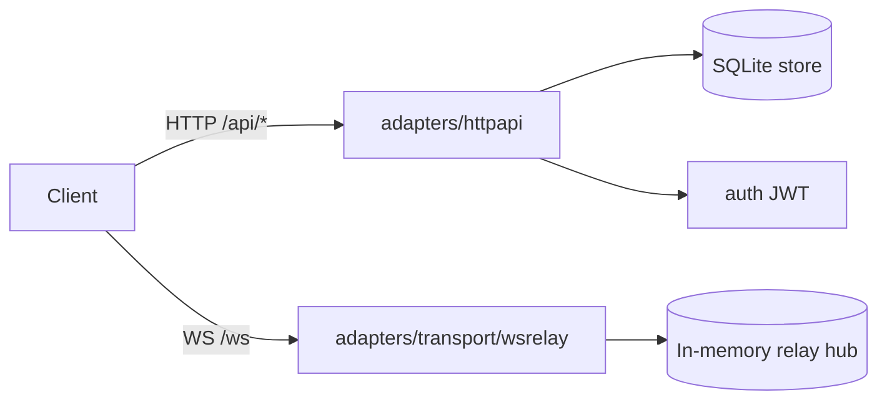
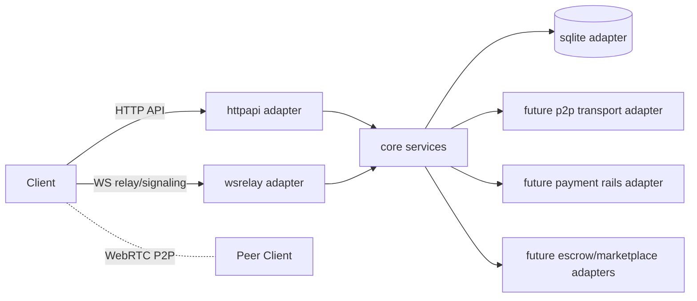

# Runtime Flows: Today and Target

## Today (Centralized Runtime)

### HTTP Flow
1. Client calls `/api/*` endpoint.
2. `adapters/httpapi` handler validates method/input.
3. Auth middleware validates JWT where required.
4. Handler calls SQLite-backed store methods.
5. API logging middleware emits request log with `request_id`.

### WebSocket Flow
1. Client connects to `/ws`.
2. WS handler authenticates bearer token (header or subprotocol).
3. WS origin allowlist check runs during upgrade.
4. Relay hub registers connected user.
5. `direct_message` is forwarded only if recipient is online.
6. Sender receives `message_ack` on success; `error` on offline recipient.

## Target (Incremental, Hybrid Runtime)

## Target Principles
- Relay remains available as fallback even after P2P adapters exist.
- HTTP API remains the orchestration surface for identity, contacts, marketplace, and ledger workflows.
- Messaging transport is an adapter concern; messaging semantics belong in core.
- External payment rails are adapters, not core business logic.
